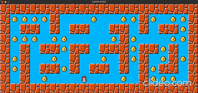

# 🎮 So Long — 2D Grid-Based Game

A simple 2D game built in C using the MiniLibX graphics library.  
Navigate through a map, collect all collectibles, and find the shortest route to the exit — all while avoiding walls!

<!--  -->

---

## 📌 Features

- **Grid-Based Map** (from `.ber` file)
- **Smooth Player Movement** (W, A, S, D)
- **Collectibles & Exit Logic**
- **Real-time Display with Move Counter**
- **MiniLibX Rendering**
- **Robust Error Handling**

---

## 🗺️ Map Format

Each map is a text-based `.ber` file with the following characters:

| Symbol | Meaning           |
|--------|-------------------|
| `0`    | Empty space       |
| `1`    | Wall              |
| `P`    | Player start      |
| `C`    | Collectible item  |
| `E`    | Exit              |

Map Rules:
- Must be rectangular
- Surrounded by walls
- Includes **at least one** `P`, `C`, and `E`
- A valid path must exist between `P` and `E`

---

## ❌ Error Handling

The program handles and reports various types of errors to ensure smooth gameplay:

- 🚫 **Invalid map structure**: Non-rectangular maps or maps with holes
- ⚠️ **Missing required characters**: Map must contain at least one `P`, one `C`, and one `E`
- 🔄 **Non-rectangular maps**: All rows must have the same length
- 📂 **File open/read errors**: Missing `.ber` file or unreadable input
- 🧠 **Memory management & cleanup**: Frees all allocated memory upon exit or failure

---
## ▶️ Run the Game

1. Compile the game:
  - make
  - ./so_long maps/example.ber

---
## 🛠️ Technologies

- **Language**: C  
- **Graphics**: [MiniLibX](https://harm-smits.github.io/42docs/libs/minilibx)  
- **Utilities**: `ft_printf`, `get_next_line` , `Libft`
- **Build Tool**: `Makefile`  
- **Libraries**: `unistd.h`, `fcntl.h`, `stdlib.h`, `X11/keysym.h`

<!-- ---

## 📷 Screenshot

 -->
